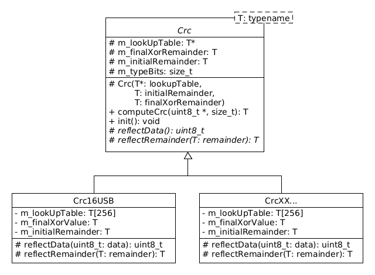

# CRC
Library for computing CRC codes both in C and C++

## FOLDER STRUCTURE

- ./         Makefile and configure scripts.
- ./build*   Used for storing build results. Must not be checked into source control.
- ./src      Main compilable source location.
- ./include  Directory for public headers.
- ./tests    Directory for tests.
- ./external Directory for packages/projects to be used by the project, but not edited as part of the project.
- ./doc      Directory for documentation files

## BUILD

### Setup

#### Google Test

Google test is added to the git repo as a git submodule, so remember to clone the repository with the `--recurse-submodules` option.

```console
$ git submodule add https://github.com/google/googletest.git ./vendor/gtest
```

Also if we are using C++20 in our project, we have to ensure that C++20 is used adding the following line in the root CMakeList file

```cmake
set(CMAKE_CXX_STANDARD 20)
```

#### Valgrind

Valgrind will be using in the unitary testing to check there are not memory leaks.

```console
sudo apt-get update
sudo apt-get -y install valgrind
```

### Unitary Testing

The unit tests will be launched using **ctest**

To build the unitary tests, first we launch CMake with the UTEST custom option and then make.

```console
cmake . -DUTEST=ON -H. -B buildtest
cd buildtest
make -j3
```

To launch **all** the tests:

```console
ctest -VV;
```

To launch only a testsuite:

```console
ctest -R "testsuite_name" -VV
```

To use **valgrind** for checking memory leaks:

```console
ctest -T memcheck -VV
```

All in one line:

```console
cmake . -DUTEST=ON -H. -B buildtest; cd buildtest; make -j3 && ctest -T memcheck -VV; cd ..
```

### Release

To build the release, first we launch CMake and then make.

```console
cmake . -H. -B build
cd build
make -j3
```

All in one line:

```console
cmake . -H. -B build; cd build; make -j3; cd ..
```

## CREATING NEW CLASSES FOR NEW CRC STANDARDS

When creating the library, a `template pattern` approach has been used. Each new standard added to the library will have its own class called CrcTXxx stored in the `include/crc/` folder in a header file called crcTxxx.h, i.e.:

* include/crc/crc8.h will have the Crc8 class for the CRC-8 algorithm
* include/crc/crc16usb.h will have the Crc16Usb class for the CRC-16/USB algorithm
* include/crc/crc32xfer.h will have the Crc32xfer class for the CRC-32/XFER algorithm

### Architecture

The new CRC class should implement the Crc class and provide the values for:

* Lookup table
* Final XOR value
* Initial remainder value
* Reflect data algorithm
* Reflect final remainder (CRC value) algorithm



*The lookup table can be generated using the 'lookup-table-generator' given the CRC standard and the generator polynomial.*

### Table of CRC Algorithms

| Algorithm          | CRC Type | Result     | Check      | Poly       | Init       | RefIn  | RefOut | XorOut     |
|:-------------------|:---------|:-----------|:-----------|:-----------|:-----------|:-------|:-------|:-----------|
| CRC-8              | uint8_t  | 0xF4       | 0xF4       | 0x07       | 0x00       | false  | false  | 0x00       |
| CRC-8/CDMA2000     | uint8_t  | 0xDA       | 0xDA       | 0x9B       | 0xFF       | false  | false  | 0x00       |
| CRC-8/DARC         | uint8_t  | 0x15       | 0x15       | 0x39       | 0x00       | true   | true   | 0x00       |
| CRC-8/DVB-S2       | uint8_t  | 0xBC       | 0xBC       | 0xD5       | 0x00       | false  | false  | 0x00       |
| CRC-8/EBU          | uint8_t  | 0x97       | 0x97       | 0x1D       | 0xFF       | true   | true   | 0x00       |
| CRC-8/I-CODE       | uint8_t  | 0x7E       | 0x7E       | 0x1D       | 0xFD       | false  | false  | 0x00       |
| CRC-8/ITU          | uint8_t  | 0xA1       | 0xA1       | 0x07       | 0x00       | false  | false  | 0x55       |
| CRC-8/MAXIM        | uint8_t  | 0xA1       | 0xA1       | 0x31       | 0x00       | true   | true   | 0x00       |
| CRC-8/ROHC         | uint8_t  | 0xD0       | 0xD0       | 0x07       | 0xFF       | true   | true   | 0x00       |
| CRC-8/WCDMA        | uint8_t  | 0x25       | 0x25       | 0x9B       | 0x00       | true   | true   | 0x00       |
| CRC-16/ARC         | uint16_t | 0xBB3D     | 0xBB3D     | 0x8005     | 0x0000     | true   | true   | 0x0000     |
| CRC-16/AUG-CCITT   | uint16_t | 0xE5CC     | 0xE5CC     | 0x1021     | 0x1D0F     | false  | false  | 0x0000     |
| CRC-16/BUYPASS     | uint16_t | 0xFEE8     | 0xFEE8     | 0x8005     | 0x0000     | false  | false  | 0x0000     |
| CRC-16/CCITT-FALSE | uint16_t | 0x29B1     | 0x29B1     | 0x1021     | 0xFFFF     | false  | false  | 0x0000     |
| CRC-16/CDMA2000    | uint16_t | 0x4C06     | 0x4C06     | 0xC867     | 0xFFFF     | false  | false  | 0x0000     |
| CRC-16/DDS-110     | uint16_t | 0x9ECF     | 0x9ECF     | 0x8005     | 0x800D     | false  | false  | 0x0000     |
| CRC-16/DECT-R      | uint16_t | 0x007E     | 0x007E     | 0x0589     | 0x0000     | false  | false  | 0x0001     |
| CRC-16/DECT-X      | uint16_t | 0x007F     | 0x007F     | 0x0589     | 0x0000     | false  | false  | 0x0000     |
| CRC-16/DNP         | uint16_t | 0xEA82     | 0xEA82     | 0x3D65     | 0x0000     | true   | true   | 0xFFFF     |
| CRC-16/EN-13757    | uint16_t | 0xC2B7     | 0xC2B7     | 0x3D65     | 0x0000     | false  | false  | 0xFFFF     |
| CRC-16/GENIBUS     | uint16_t | 0xD64E     | 0xD64E     | 0x1021     | 0xFFFF     | false  | false  | 0xFFFF     |
| CRC-16/KERMIT      | uint16_t | 0x2189     | 0x2189     | 0x1021     | 0x0000     | true   | true   | 0x0000     |
| CRC-16/MAXIM       | uint16_t | 0x44C2     | 0x44C2     | 0x8005     | 0x0000     | true   | true   | 0xFFFF     |
| CRC-16/MCRF4XX     | uint16_t | 0x6F91     | 0x6F91     | 0x1021     | 0xFFFF     | true   | true   | 0x0000     |
| CRC-16/MODBUS      | uint16_t | 0x4B37     | 0x4B37     | 0x8005     | 0xFFFF     | true   | true   | 0x0000     |
| CRC-16/RIELLO      | uint16_t | 0x63D0     | 0x63D0     | 0x1021     | 0xB2AA     | true   | true   | 0x0000     |
| CRC-16/T10-DIF     | uint16_t | 0xD0DB     | 0xD0DB     | 0x8BB7     | 0x0000     | false  | false  | 0x0000     |
| CRC-16/TELEDISK    | uint16_t | 0x0FB3     | 0x0FB3     | 0xA097     | 0x0000     | false  | false  | 0x0000     |
| CRC-16/TMS37157    | uint16_t | 0x26B1     | 0x26B1     | 0x1021     | 0x89EC     | true   | true   | 0x0000     |
| CRC-16/USB         | uint16_t | 0xB4C8     | 0xB4C8     | 0x8005     | 0xFFFF     | true   | true   | 0xFFFF     |
| CRC-16/X-25        | uint16_t | 0x906E     | 0x906E     | 0x1021     | 0xFFFF     | true   | true   | 0xFFFF     |
| CRC-16/XMODEM      | uint16_t | 0x31C3     | 0x31C3     | 0x1021     | 0x0000     | false  | false  | 0x0000     |
| CRC-A              | uint16_t | 0xBF05     | 0xBF05     | 0x1021     | 0xC6C6     | true   | true   | 0x0000     |
| CRC-32             | uint32_t | 0xCBF43926 | 0xCBF43926 | 0x04C11DB7 | 0xFFFFFFFF | true   | true   | 0xFFFFFFFF |
| CRC-32/BZIP2       | uint32_t | 0xFC891918 | 0xFC891918 | 0x04C11DB7 | 0xFFFFFFFF | false  | false  | 0xFFFFFFFF |
| CRC-32/JAMCRC      | uint32_t | 0x340BC6D9 | 0x340BC6D9 | 0x04C11DB7 | 0xFFFFFFFF | true   | true   | 0x00000000 |
| CRC-32/MPEG-2      | uint32_t | 0x0376E6E7 | 0x0376E6E7 | 0x04C11DB7 | 0xFFFFFFFF | false  | false  | 0x00000000 |
| CRC-32/POSIX       | uint32_t | 0x765E7680 | 0x765E7680 | 0x04C11DB7 | 0x00000000 | false  | false  | 0xFFFFFFFF |
| CRC-32/SATA        | uint32_t | 0xCF72AFE8 | 0xCF72AFE8 | 0x04C11DB7 | 0x52325032 | false  | false  | 0x00000000 |
| CRC-32/XFER        | uint32_t | 0xBD0BE338 | 0xBD0BE338 | 0x000000AF | 0x00000000 | false  | false  | 0x00000000 |
| CRC-32C            | uint32_t | 0xE3069283 | 0xE3069283 | 0x1EDC6F41 | 0xFFFFFFFF | true   | true   | 0xFFFFFFFF |
| CRC-32D            | uint32_t | 0x87315576 | 0x87315576 | 0xA833982B | 0xFFFFFFFF | true   | true   | 0xFFFFFFFF |
| CRC-32Q            | uint32_t | 0x3010BF7F | 0x3010BF7F | 0x814141AB | 0x00000000 | false  | false  | 0x00000000 |

### Commands for generate the libs

```shell
./build/bin/crc-lib-generator crc16arc -w 16 -c 0xBB3D -p 0x8005 -i 0x0000 -d -o -x 0x0000
./build/bin/crc-lib-generator crc16augccitt -w 16 -c 0xE5CC -p 0x1021 -i 0x1D0F -x 0x0000
./build/bin/crc-lib-generator crc16buypass -w 16 -c 0xFEE8 -p 0x8005 -i 0x0000 -x 0x0000
./build/bin/crc-lib-generator crc16ccittfalse -w 16 -c 0x29B1 -p 0x1021 -i 0xFFFF -x 0x0000
./build/bin/crc-lib-generator crc16cdma2000 -w 16 -c 0x4C06 -p 0xC867 -i 0xFFFF -x 0x0000
./build/bin/crc-lib-generator crc16dds110 -w 16 -c 0x9ECF -p 0x8005 -i 0x800D -x 0x0000
./build/bin/crc-lib-generator crc16dectr -w 16 -c 0x007E -p 0x0589 -i 0x0000 -x 0x0001
./build/bin/crc-lib-generator crc16dectx -w 16 -c 0x007F -p 0x0589 -i 0x0000 -x 0x0000
./build/bin/crc-lib-generator crc16dnp -w 16 -c 0xEA82 -p 0x3D65 -i 0x0000 -d -o -x 0xFFFF
./build/bin/crc-lib-generator crc16en13757 -w 16 -c 0xC2B7 -p 0x3D65 -i 0x0000 -x 0xFFFF
./build/bin/crc-lib-generator crc16genibus -w 16 -c 0xD64E -p 0x1021 -i 0xFFFF -x 0xFFFF
./build/bin/crc-lib-generator crc16kermit -w 16 -c 0x2189 -p 0x1021 -i 0x0000 -d -o -x 0x0000
./build/bin/crc-lib-generator crc16maxim -w 16 -c 0x44C2 -p 0x8005 -i 0x0000 -d -o -x 0xFFFF
./build/bin/crc-lib-generator crc16mcrf4xx -w 16 -c 0x6F91 -p 0x1021 -i 0xFFFF -d -o -x 0x0000
./build/bin/crc-lib-generator crc16modbus -w 16 -c 0x4B37 -p 0x8005 -i 0xFFFF -d -o -x 0x0000
./build/bin/crc-lib-generator crc16riello -w 16 -c 0x63D0 -p 0x1021 -i 0xB2AA -d -o -x 0x0000
./build/bin/crc-lib-generator crc16t10dif -w 16 -c 0xD0DB -p 0x8BB7 -i 0x0000 -x 0x0000
./build/bin/crc-lib-generator crc16teledisk -w 16 -c 0x0FB3 -p 0xA097 -i 0x0000 -x 0x0000
./build/bin/crc-lib-generator crc16tms37157 -w 16 -c 0x26B1 -p 0x1021 -i 0x89EC -d -o -x 0x0000
./build/bin/crc-lib-generator crc16usb -w 16 -c 0xB4C8 -p 0x8005 -i 0xFFFF -d -o -x 0xFFFF
./build/bin/crc-lib-generator crc16x25 -w 16 -c 0x906E -p 0x1021 -i 0xFFFF -d -o -x 0xFFFF
./build/bin/crc-lib-generator crc16xmodem -w 16 -c 0x31C3 -p 0x1021 -i 0x0000 -x 0x0000
./build/bin/crc-lib-generator crc16a -w 16 -c 0xBF05 -p 0x1021 -i 0xC6C6 -d -o -x 0x0000

./build/bin/crc-lib-generator crc32 -w 32 -c 0xCBF43926 -p 0x04C11DB7 -i 0xFFFFFFFF -d -o -x 0xFFFFFFFF
./build/bin/crc-lib-generator crc32bzip2 -w 32 -c 0xFC891918 -p 0x04C11DB7 -i 0xFFFFFFFF -x 0xFFFFFFFF
./build/bin/crc-lib-generator crc32jamcrc -w 32 -c 0x340BC6D9 -p 0x04C11DB7 -i 0xFFFFFFFF -d -o -x 0x00000000
./build/bin/crc-lib-generator crc32mpeg2 -w 32 -c 0x0376E6E7 -p 0x04C11DB7 -i 0xFFFFFFFF -x 0x00000000
./build/bin/crc-lib-generator crc32posix -w 32 -c 0x765E7680 -p 0x04C11DB7 -i 0x00000000 -x 0xFFFFFFFF
./build/bin/crc-lib-generator crc32sata -w 32 -c 0xCF72AFE8 -p 0x04C11DB7 -i 0x52325032 -x 0x00000000
./build/bin/crc-lib-generator crc32xfer -w 32 -c 0xBD0BE338 -p 0x000000AF -i 0x00000000 -x 0x00000000
./build/bin/crc-lib-generator crc32c -w 32 -c 0xE3069283 -p 0x1EDC6F41 -i 0xFFFFFFFF -d -o -x 0xFFFFFFFF
./build/bin/crc-lib-generator crc32d -w 32 -c 0x87315576 -p 0xA833982B -i 0xFFFFFFFF -d -o -x 0xFFFFFFFF
./build/bin/crc-lib-generator crc32q -w 32 -c 0x3010BF7F -p 0x814141AB -i 0x00000000 -x 0x00000000
```

## REFERENCES

- [Online CRC-8 CRC-16 CRC-32 Calculator](https://crccalc.com/)
- [Barr Group. CRC Series, Part 3: CRC Implementation Code in C/C++](https://barrgroup.com/embedded-systems/how-to/crc-calculation-c-code)

## TBD.

- Change Makefile option for unit testing from custom UTEST to using CMAKE_BUILD_TYPE with a custom build type called unitary testing or so. <https://stackoverflow.com/questions/48754619/what-are-cmake-build-type-debug-release-relwithdebinfo-and-minsizerel>
